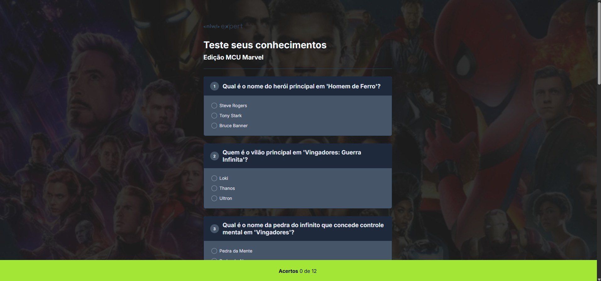
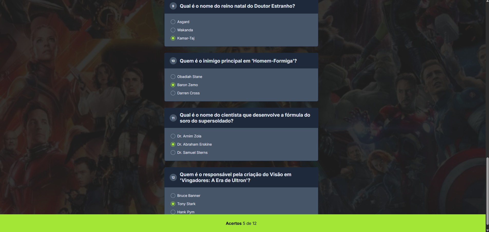

# Test Your Knowledge - Marvel MCU Edition
A quiz application about the Marvel Cinematic Universe (MCU), developed in Rocketseat's NLW Experts, using semantic HTML, CSS, and JavaScript.

## 🛠️ Technologies Used
- HTML5
- CSS3
- JavaScript

## 👀 How to View
1. To view the project locally, clone or download the repository and open the index.html file in your web browser.
2. Alternatively, visit the live version at [gsbado.github.io/projeto-gta/.](https://gsbado.github.io/nlw-experts/)

## 🙌 Credits
- Original project by Rocketseat (NLW Experts – HTML+CSS+JS)
- Modified by Gabriela Spanemberg Bado
- Background Image: Marvel Studios

## 📄 License
This project is for educational purposes.

## 🖥️ Preview

> Examples of the project interface.
